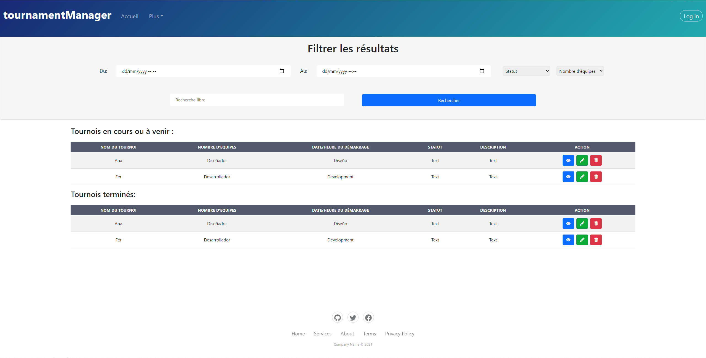
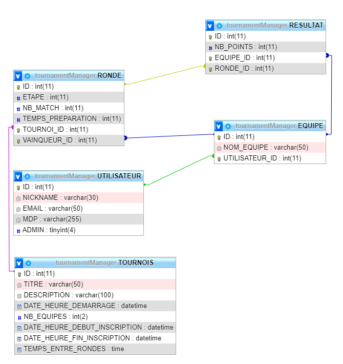
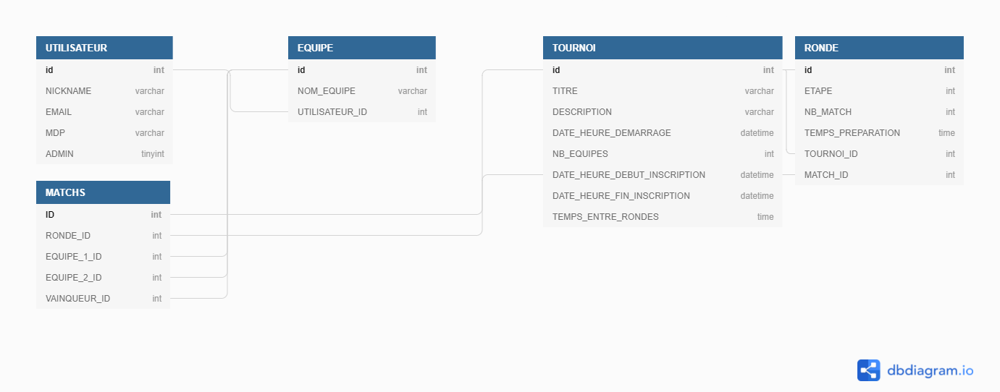
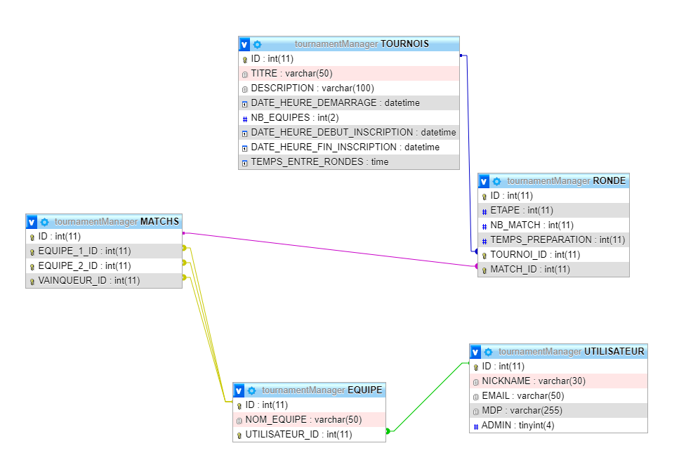
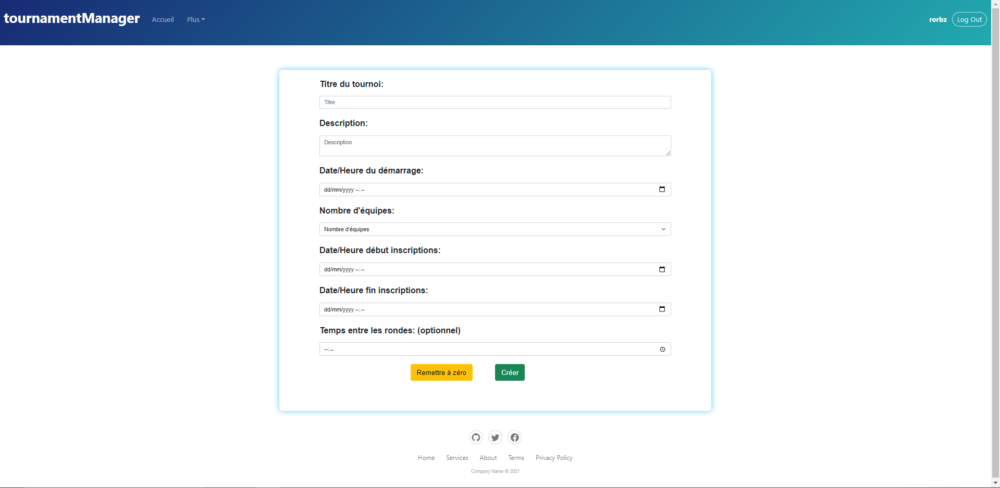
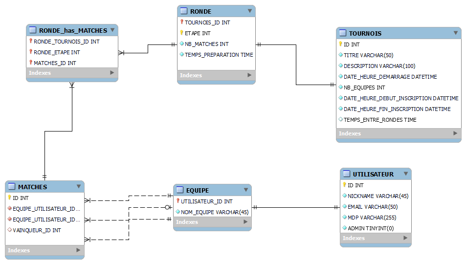
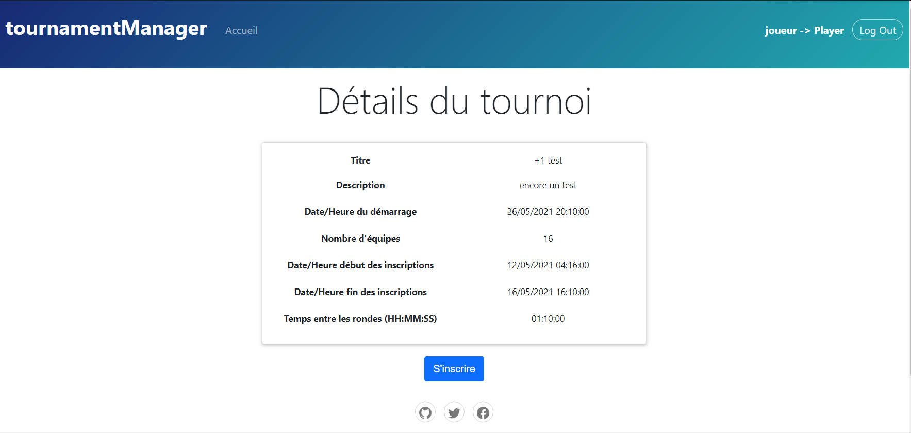

# Journal de bord 📝

## <u>1er jour - 03/05/2021</u>

### Matin:

- 7:30 : Enfin arrivé en classe, je peux débuter mon TPI. J'ai reçu l'énoncé du travail par email. Actuellement j'essaye de me familiariser avec toutes les tâches réquises. Je m'octroie une bonne heure afin d'être au clair avec chaque critères, puis je vais passer à l'élaboration du planning prévisionnel.

- 8:30 : Passage à l'élaboration du planning prévisionnel 🚧

- 9:40 : Début de la pause

- 10:05 : Fin de la pause. Après avoir établi les tâches principales dans le planning, je passe à l'élaboration du MCD (celui-ci changera au fur et à mesure que M. Aigroz me précise les différentes choses qui doivent être stockées dans la base de données) ❗

### MCD Initial 🛠️


- 11:40 : Structure du projet mise à jour, voir README à la racine du projet

### Après-midi:

- 12:40 : Problème avec Apache et WSL2 🔺

- 13:10 : Apache s'est finalement lancé, cepedant j'ai perdu 30 min donc je devrai accélerer le rythme dès à présent!

- 13:10 - 14:15 : Je vais passer sur la "construction" ou plutôt l'assemblage de ma page d'accueil qui servira de patron pour les autres pages du site

- 14:15 : Début de la pause

- 14:35 : Fin de la pause

- 14:35 - 16:00 : Je paufine l'affichage de la page d'accueil pour pouvoir par la suite simplement intégré le conteneur (c-à-d div) dans lequel j'afficherai les tournois en cours ainsi que les tournois à venir

- 16:00 : Pour les dernières 45 minutes de la journée, je vais me focaliser sur la documentation ➡️ en fonction du temps disponible durant les prochains jours, j'essayerai d'allouer quotidiennement ces trois quarts d'heures pour rédiger et compléter ma documentation technique ainsi que le manuel d'utilisateur

- 16:45 : Fin de la 1ère journée

  - Bilan:
    - Planning prévisionnel établi
    - MCD v0.1 -> à retravailler par la suite
    - Page d'accueil prête à ~ 50 %
    - La structure et les bases du projet sont posées

- N.B.: J'ai un certain nombre de questions pour M. Aigroz

## <u>2ème jour - 04/05/2021</u>

### Matin:

- 7:30 : Le début d'une nouvelle journée commence. La veille j'ai eu une visio-conférence avec M. Aigroz et les deux autres élèves qu'il suit pour le TPI. Nous avons eu l'occasion de pouvoir clarifier certains détails ainsi qu'obtenir des réponses à nos questions. M. Aigroz m'a indiqué que je dois consacrer la journée d'aujourd'hui à l'élaboration des maquettes des pages du site internet et par la suite approfondir le MCD car comme je le pensais, il était bien trop léger.

- 09:01 : Vu que j'avais un doute concernant l'énoncé, j'ai décidé de poser la question à M. Aigroz

> Bonjour Monsieur, je voulais vous demander si dans mon énoncé la phrase "- (optionnel) Temps en heures entre les rondes (phases) du tournoi" signifie optionnel pour le développement ou c'est un critère optionnel pour la création d'un tournoi que je devrai cependant développer?

- 09:13 : M. Aigroz m'a répondu en clarifiant que c'est une fonctionnalité que je dois implémenter

> Ce qui est optionnel, c'est qu'au moment de créer le tournoi, l'administrateur peut (optionnel) spécifier un temps en heures entre les rondes. Si l'administrateur ne spécifie rien, la ronde suivante sera démarrée lorsque l'administrateur aura saisi tous les résultats de la ronde en cours.

- 09:40 : Début de la pause

- 10:05 : Fin de la pause, j'ai terminé les maquettes provisoires, dès à présent je vais continuer le travail sur le MCD

- 11:20 : Nouvelle version du MCD ❗


- 11:40 : C'est tout pour la matinée! 🍕

### Après-midi:

- 12:40 : En ayant terminé le matin les choses demandées par M. Aigroz, je décide de passer au design du site, je vais me concentrer en particulier sur la page d'accueil et la page d'authentification.

- 13:00 : Recherche des templates sur Bootstrap Studio pour le CRUD de la page d'accueil

- 13:00 : Template trouvée, je passe à l'intégration du CRUD dans ma page d'accueil

- 14:15 : Début de la pause ☕, l'intégration du CRUD est presque terminée, il ne reste plus qu'à ajuster la CSS afin que les éléments du filtre pour la recherche soient correctement alignés

- 14:35 : Fin de la pause, je reprends le travail

- 15:00 : Design de la page d'accueil terminé ✅



- 15:10 : Je passe à la page d'authentification, recherche des templates sur Bootstrap Studio pour le login

- 15:20 : Template choisie, je passe à l'intégration

- 15:40 : Je décide d'ajouter un effet parallax à la page

- 15:55 : Design de la page d'authentification terminé


- 16:00 : En essayant de respecter la règle que je me suis imposée, je passer à la partie documentation de la journée 📄

- 16:45 : Fin de la journée, enfin.. 😵

## <u>3ème jour - 05/05/2021</u>

### Matin:

- 7:30 : Lors du "webmeeting" de la veille, M. Aigroz m'a conseillé de retravailler mes maquettes en supprimant certaines qui seront inutiles par contre il faut impérativement que je refasse les maquettes pour la page du détails des tournois, avec les différents use-cases (utilisateur déconnecté/connecté, compte admin). C'est ce que je vais faire maintenant.

- 9:40 : Début de la pause.

- 10:05 : Fin de la pause.

- 10:45 : J'ai terminé la grande majorité des maquettes avec les différents use-cases.

- 10:50 : Je vais approfondir la documentation technique.

- 11:40 : Pause de midi.

### Après-midi:

- 12:40 : J'avance la doc...

- 13:30 : La partie avant la planification est terminée, je passe à l'implémentation du MCD, pour cela j'utiliserai phpMyAdmin.

- 14:00 : Voici la première version du MPD basé sur le deuxième version du MCD



- 14:15 : Début de la pause ☕

- 14:35 : Fin de la pause, dès à présent je vais travailler sur ma classe utilisateur_tM. M. Aigroz m'a indiqué ma fonction SelectAll() retournait un tableau de valeur et non pas un tableau d'objet. Suite à cela je vais retravailler cette fonction afin que j'obtienne les résultats désiré.

- 15:45 : Voici la fonction retravaillée:

```php
    /**
     * Fonction qui retourne un tableau d'objets, chaque objet dans le tableau est un utilisateur
     *
     * @return array
     */
    public function SelectAll(): array
    {
        $results = array();

        $query = Database::getInstance()->prepare("SELECT * FROM UTILISATEUR");
        $query->execute();

        while ($rowInDb = $query->fetch(PDO::FETCH_ASSOC)) {

            $utilisateur = new Utilisateur_tM();

            $utilisateur->setId($rowInDb['ID']);
            $utilisateur->setNickname($rowInDb['NICKNAME']);
            $utilisateur->setEmail($rowInDb['EMAIL']);
            $utilisateur->setMdp($rowInDb['MDP']);
            $utilisateur->setAdmin((int)$rowInDb['ADMIN']);

            array_push($results, $utilisateur);
        }

        return $results;
    }
```

Afin de pouvoir comparé, voici la fonction précédente:

```php
    /**
     * Fonction qui retourne tous les utilisateurs et leurs infos stockées dans la BDD
     *
     * @return array
     */
    public function SelectAll(): array
    {

        $query = Database::getInstance()->prepare("SELECT * FROM utilisateur");
        $query->setFetchMode(PDO::FETCH_ASSOC);
        $query->execute();

        $result = $query->fetchAll();
        return $result;
    }
```

- 16:00 : Je passe à la partie documentation de la journée 📄

- 16:45 : Fin d'une longue et triste journée...

## <u>4ème jour - 06/05/2021 (Fin de la première semaine)</u>

### Matin:

- 7:30 : Arrivé en classe, je revois les choses qui ont été faites la veille afin d'éviter de se perdre dès le début de la journée

- 8:05 : Webmeeting avec M. Aigroz.

  - La première remarque était que la table RESULTAT n'est pas vraiment utile, je pourrais la remplacer avec une table MATCH dans laquelle je stockerai l'ID du vainqueur du match
  - Le deuxième point consistait à revoir la fonction qui retourne tous les utilisateurs, suivant l'exemple qui a été déposé sur Classroom par M. Aigroz
  - ❗ expliciter les champs dans la requête SQL, éviter '(SELECT \* FROM ....)'
  - Dans le modèle de la base de données (database.php), déclarer le constructeur comme privé. Utiliser la fonction finale \_\_callStatic qui appellera elle-même la fonction getInstance()
  - Dernières remarques, créer un en-tête dans tous les fichiers et **commenter les return de TOUTES les fonctions**

- 8:40 : Fin du Webmeeting, je vais passer sur l'implémentation de la table MATCHS dans la bdd

- 9:00 : Voici le nouveau MCD



- 9:10 : Voici le MPD:



- 9:30 : Visites des experts

- 11:40 : Début de la pause de midi

### Après-midi:

- 12:40 : Fin de la pause de midi, dès à présent je vais me focaliser sur le mécanisme sur la logique de l'authentification

- 16:25 : Cela m'a pris plus de temps que je voulais, cependant l'authentification fonctionne sans bug et tous les cas d'erreur sont gérés ✅

Voici la logique pour l'authentification:

```php
if ($submit) {

    if (count($_POST) === NB_POST_INPUT) {

        if (preg_match($regexEmail, $_POST['email'])) {

            $userEmail = $_POST['email'];
        }

        if ($u_controller->CheckIfEmailExists($userEmail)) {

            if (isset($_POST['password'])) {

                $userPassword = $_POST['password'];

                $hashedPassword = $u_controller->GetHashPassword($userEmail);

                if (password_verify($userPassword, $hashedPassword)) {

                    $_SESSION['isLoggedIn'] = true;

                    $_SESSION['username'] = $u_controller->GetNicknameOfUser($userEmail);

                    header('Location: ./');
                } else {
                    $error = true;
                }
            }
        } else {

            $error = true;
        }
    } else {
        $error = true;
    }
}
```

Et voici les fonctions qui en lien avec l'authentification qui se trouvent dans le fichier utlisateur_tM_controller.php

```php
public function CheckIfEmailExists($anEmail): bool
{
    $query = Database::prepare("SELECT * FROM UTILISATEUR WHERE `EMAIL` = :EMAIL");

    $query->bindParam(':EMAIL', $anEmail, PDO::PARAM_STR);

    try {

        $query->execute();
        $userExists = $query->fetch();

        if ($userExists != false) {
            $userExists = true;
        }

        return $userExists;
    } catch (PDOException $e) {

        return false;
    }
}

public function GetHashPassword($anEmail): string
{
    $query = Database::prepare("SELECT MDP FROM UTILISATEUR WHERE `EMAIL` = :EMAIL");

    $query->bindParam(':EMAIL', $anEmail, PDO::PARAM_STR);
    $query->setFetchMode(PDO::FETCH_ASSOC);

    try {
        $query->execute();
        $queryResult = $query->fetch();

        $pwd = $queryResult['MDP'];

        return $pwd;
    } catch (PDOException $e) {
        return false;
    }
}

public function GetNicknameOfUser($anEmail): string
{
    $query = Database::prepare("SELECT `NICKNAME` FROM UTILISATEUR WHERE `EMAIL` = :EMAIL");

    $query->bindParam(':EMAIL', $anEmail, PDO::PARAM_STR);
    $query->setFetchMode(PDO::FETCH_ASSOC);

    try {
        $query->execute();
        $queryResult = $query->fetch();

        $nickname = $queryResult['NICKNAME'];

        return $nickname;
    } catch (PDOException $e) {
        return false;
    }
}
```

- 16:45 : Fin de la journée ❗

## <u>5ème jour - 10/05/2021 (Début de la deuxième semaine)</u>

### Matin:

- 7:30 : Comme M. Aigroz me la précisé, je me suis pas mal avancé sur le projet en lui par contre il faut que j'intègre et explique mes maquettes dans la documentation technique. Je vais consacrer cette matinée à cela afin de ne pas prendre trop de retard sur la doc.

- 9:40 : Début de la pause.

- 10:05 : Fin de la pause, je continue à travailler sur la doc.

- 10:40 : Toutes les maquettes ont été intégrées et expliquées dans la documentation. Dès lors je vais continuer le développement.

- 10:45 : Problème avec la redirection vers la page de création de tournoi fixé.

- 11:40 : Visuel du formulaire de création de tournoi terminé. Pause de midi.

### Après-midi:

- 12:40 - 14:15: ❗ Conflit entre le serveur MySQL et MariaDB, le site ne trouve plus ma base de données 😢

- 14:35: Il devient critique de finaliser complètement ma base de données. Je vais écrire à M. Aigroz afin de pouvoir régler cela!

- 15:00: J'ai écrit un email à M. Aigroz. J'espère que j'obtiendrai bientôt une réponse. Je vais continuer à avancer le développement du site.

- 15:50: Le formulaire de création de tournoi est fonctionnel ✅



- 16:30: Problème avec la conversion de la chaine de caractères qui représente la date au format DateTime de php.

- 16:45: Fin de la journée, pas mal de problème à résoudre mais on est sur la bonne voie.

## <u>6ème jour - 11/05/2021</u>

### Matin:

- 7:30: Début d'une nouvelle journée. Lors du webmeeting de la veille, M. Aigroz m'a aidé à finaliser mon modèle de données. Voici la version proposée.



- 7:45: Le problème avec les clés étangères persiste, ça devient très pénible et cela commence à me ralentir par rapport au développement.. Il faut que je trouve quelque chose et rapidement

- 8:40: ENFIN!!! J'ai réussi à faire le Forward Engineer du diagramme EER, le problème était que Workbench rajoutait dans le script SQL un attribut "VISIBLE" aux clés étrangères qui faisait planter l'import. Je peux ENFIN continuer le développement! 🎆

- 9:40: Les tournois se créent et sont correctement stockés dans la bdd. Début de la pause.

- 10:05: Fin de la pause. Je vais travailler sur l'affichage des tournois sur la page d'accueil.

- 10:40: La suppression des tournois fonctionne.

```php
/**
* Fonction qui efface un tournoi de la base de données
*
* @param int $idTournoi
* @return boolean
*/
public function DeleteTournament($idTournoi): bool
{
    $query = Database::prepare("DELETE FROM TOURNOIS WHERE ID = :ID");

    $query->bindParam(":ID", $idTournoi);

    $delSuccess = $query->execute();
    return $delSuccess;
}
```

- 11:00: Problème avec les comparaisons de date. M. Garcia me conseillera à ce sujet

- 11:20: Problème réglé, il fallait que je fasse des comparaisons non pas sur des dates mais sur des timestamp grâce à la fonction:

```php
strtotime()
```

Exemple ci-dessous:

```php
foreach ($allTournaments as $aTournament) {
    $statut = (strtotime($aTournament->getDateHeureDemarrage()) < $currentDate) ? "<td><h5>En cours</h5></td>" :  "<td><h5>A venir</h5></td>";
    $displayDate = date("d/m/Y H:i:s", strtotime($aTournament->getDateHeureDemarrage()));
    echo "<tr>";
    echo "<td><h5>" . $aTournament->getTitre() . "</h5></td>";
    echo "<td><h5>" . $aTournament->getDescription() . "</h5></td>";
    echo "<td><h5>" . $aTournament->getNbEquipes() . "</h5></td>";
    echo "<td><h5>" . $displayDate . "</h5></td>";
    echo $statut;
    echo "<td class='text-center'>";
    echo "<a class='btn btn-primary' role='button' style='margin: 2px;'><i class='bi bi-eye-fill'></i></a>";
    if (strtotime($aTournament->getDateHeureDebutInscription()) > $currentDate && isset($_SESSION['isLoggedIn'])) {
    echo "<a class='btn btn-success' role='button' style='background: rgb(11,171,56); margin: 2px;' href='./?action=edit&id=" . $aTournament->getId() . "'><i class='bi bi-pencil-fill'></i></a>";
    echo "<a class='btn btn-danger' role='button' style='margin: 2px;' href='./?action=delete&id=" . $aTournament->getId() . "'><i class='bi bi-trash-fill'></i></a>";
    }
    echo "</td>";
    echo "</tr>";
}
```

- 11:40: Pause de midi!

### Après-midi:

- 12:40: Fin de la pause, je passe à la création du formulaire de modification de tournoi

- 14:15: La modification de tournoi est fonctionnelle ✅ Début de la pause.

- 14:35: Fin de la pause, je vais débuter la conception de la page du détail du tournoi

- 16:45: Fin de la journée. Le développement avance.

## <u>7ème jour - 12/05/2021</u>

### Matin:

- 7:30: Je vais avancer la page du détail du tournoi.

- 9:00: La page du détail s'adapte dans le cas si l'utilisateur est administrateur ou pas. Dans le cas de l'utilisateur simple, si les inscriptions ont déjà débuté, un bouton "S'inscrire" apparaît en bas du détail, ex:



- 9:10: Je vais m'occuper du filtrage de la recherche sur la page d'accueil

- 9:40: Pause. Le filtre fonctionne sur l'input type="search" par contre il filtre toutes les colonnes.. Il faut que je filtre uniquement les deux premières.

- 10:05: Fin de la pause. Je continue à travailler sur le filtre

- 10:30: J'ai finalement réussi à faire filtrer uniquement les deux premières colonnes ✅ Voici le script ci-dessous:

```javascript
/**
 * Source: https://stackoverflow.com/questions/43622127/filtering-table-multiple-columns
 */
function SearchFilter() {
  let input = document.getElementById("myInput");
  let filter = input.value.toUpperCase();
  let table = document.getElementById("ipi-table");
  let tr = table.getElementsByTagName("tr");

  for (var i = 0; i < tr.length; i++) {
    td = tr[i].getElementsByTagName("td")[0]; // for column one
    td1 = tr[i].getElementsByTagName("td")[1]; // for column two
    if (td) {
      if (
        td.innerHTML.toUpperCase().indexOf(filter) > -1 ||
        td1.innerHTML.toUpperCase().indexOf(filter) > -1
      ) {
        tr[i].style.display = "";
      } else {
        tr[i].style.display = "none";
      }
    }
  }
}
```

### Après-midi:

- 10:50 - 14:50 : M. Aigroz m'aide avec la suite de la logique du tournoi

- 15:00: Je passe aux tests des fonctions

- 16:45: Fin de la journée

## <u>8ème jour - 10/05/2021 (Début de la troisième semaine)</u>

### Matin:

- 7:30: J'ai malheureusement un problème bloquant.. MariaDB n'autorise pas les conditions LIMIT dans les sous-requête ce qui m'empêche de récupérer les vainqueurs de la ronde précendente afin de pouvoir les comparer avec les autres utilisateurs pour construire le tableau des équipes qui ont perdu l'étape précedente

- 9:00: M. Zanardi m'a indiqué que je pouvais normalement faire cela en deux requêtes séparées, cependant cela ne sera pas optimal car ces requêtes ne pourront pas s'adapter aux nombres de matchs dans chaque ronde

- 9:40: Début de la pause

- 10:05: Fin de la pause

- 10:30: Je continue l'implémentation de ces deux requêtes mais je rencontre certains problèmes, l'une d'elles est que je dois passer dans la condition NOT IN des valeurs d'entiers, mais mon tableau transforme mes entiers en caractères..

- 11:30: Finalement la fonction semble fonctionner, voir l'extrait du code ci-dessous. Début de la pause de midi

```php
$queryGetIdsWinners = Database::prepare("SELECT DISTINCT `MATCHES`.`VAINQUEUR_ID`
FROM `tournamentManager`.`MATCHES`
INNER JOIN `tournamentManager`.`RONDE_has_MATCHES`
WHERE `MATCHES`.`ID` = `RONDE_has_MATCHES`.`MATCHES_ID`
AND `RONDE_has_MATCHES`.`RONDE_ETAPE` = :RONDE_ETAPE
AND `RONDE_has_MATCHES`.`RONDE_TOURNOIS_ID` = :RONDE_TOURNOIS_ID
ORDER BY `MATCHES`.`ID` DESC
LIMIT 4;");

$queryGetIdsWinners->bindParam(':RONDE_ETAPE', $prevLevel, PDO::PARAM_INT);
$queryGetIdsWinners->bindParam(':RONDE_TOURNOIS_ID', $tournoiId, PDO::PARAM_INT);

$queryGetIdsWinners->execute();

while ($rowInDb = $queryGetIdsWinners->fetch(PDO::FETCH_ASSOC)) {

    $equipeWinner = Equipe_tM_Controller::FindTeam((int)$rowInDb['VAINQUEUR_ID']);
    array_push($tabWinners, $equipeWinner);
}

$arrWinnersIds = array();

    foreach ($tabWinners as $winnerTeam) {

        $idTeam = (int)$winnerTeam->getId();
        array_push($arrWinnersIds, $idTeam);
    }

$queryGetIdsLosers = Database::prepare("SELECT DISTINCT `EQUIPE`.`UTILISATEUR_ID`
FROM `tournamentManager`.`EQUIPE`, `tournamentManager`.`MATCHES`, `tournamentManager`.`RONDE_has_MATCHES`, `tournamentManager`.`TOURNOIS_has_EQUIPE`
WHERE `RONDE_has_MATCHES`.`RONDE_ETAPE` = :RONDE_ETAPE
AND `RONDE_has_MATCHES`.`RONDE_TOURNOIS_ID` = :RONDE_TOURNOIS_ID
AND `EQUIPE`.`UTILISATEUR_ID` = `TOURNOIS_has_EQUIPE`.`EQUIPE_UTILISATEUR_ID`
AND `EQUIPE`.`UTILISATEUR_ID` NOT IN (
    :winner1, :winner2, :winner3, :winner4
)");

$queryGetIdsLosers->bindParam(':RONDE_ETAPE', $prevLevel, PDO::PARAM_INT);
$queryGetIdsLosers->bindParam(':RONDE_TOURNOIS_ID', $tournoiId, PDO::PARAM_INT);
$queryGetIdsLosers->bindParam(':winner1', $arrWinnersIds[0], PDO::PARAM_STR);
$queryGetIdsLosers->bindParam(':winner2', $arrWinnersIds[1], PDO::PARAM_STR);
$queryGetIdsLosers->bindParam(':winner3', $arrWinnersIds[2], PDO::PARAM_STR);
$queryGetIdsLosers->bindParam(':winner4', $arrWinnersIds[3], PDO::PARAM_STR);

$queryGetIdsLosers->execute();

while ($rowInDb = $queryGetIdsLosers->fetch(PDO::FETCH_ASSOC)) {

    // $equipeLoser = Equipe_tM_Controller::FindTeam((int)$rowInDb['UTILISATEUR_ID']);
    $equipeLoser = $rowInDb['UTILISATEUR_ID'];
    array_push($tabLosers, (int)$equipeLoser);
}

$count = 0;
foreach ($tabLosers as $team) {
    $equipeLoser = Equipe_tM_Controller::FindTeam($team);
    unset($tabLosers[$count]);
    array_push($tabLosers, $equipeLoser);
    $count++;
}
```

### Après-midi:

- 12:40: Fin de la pause de midi, je vais approfondir l'interface

- 13:40: Pendant le laps de temps entre le début et la fin des inscription, dans le détail du tournoi, le bouton "S'inscrire" s'affiche si l'utilisateur ne s'est pas inscrit, dans le cas contraire, s'il est déjà inscrit, le bouton "Se désinscire" s'affiche. Je vais passer à l'affichage des résultats intermédiaires des rondes

- 14:15: Début de la pause.

- 14:35: Fin de la pause. Je continue à travailler sur la page du détail du tournoi

- 16:00: Le tableau des résultats affiche les points que chaque équipe a obtenu à chaque étape/ronde du tournoi

- 16:45: Fin d'une longue journée, il reste encore pas mal de travailler cependant j'arriverai à tout finir, je n'ai pas le choix!
