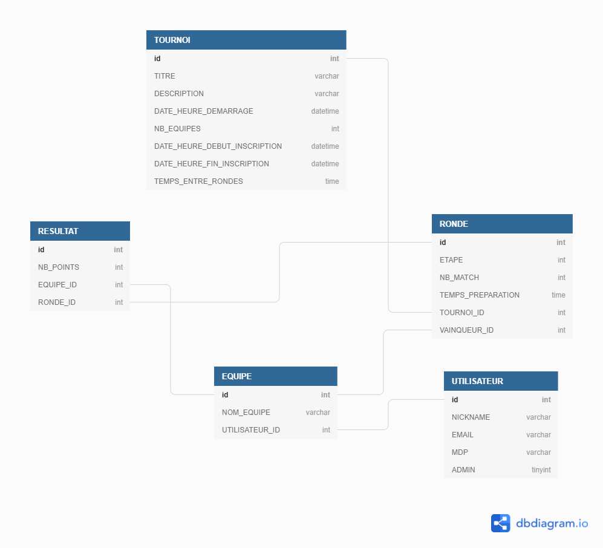
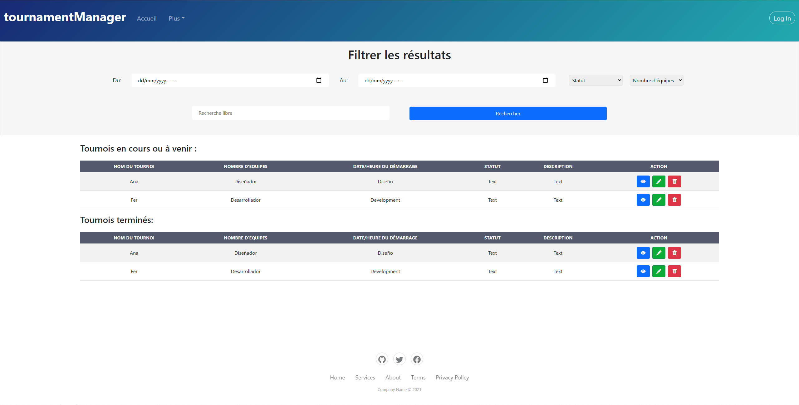

# Journal de bord 📝

## <u>1er jour - 03/05/2021</u>

### Matin:

- 7:30 : Enfin arrivé en classe, je peux débuter mon TPI. J'ai reçu l'énoncé du travail par email. Actuellement j'essaye de me familiariser avec toutes les tâches réquises. Je m'octroie une bonne heure afin d'être au clair avec chaque critères, puis je vais passer à l'élaboration du planning prévisionnel.

- 8:30 : Passage à l'élaboration du planning prévisionnel 🚧

- 9:40 : Début de la pause

- 10:05 : Fin de la pause. Après avoir établi les tâches principales dans le planning, je passe à l'élaboration du MCD (celui-ci changera au fur et à mesure que M. Aigroz me précise les différentes choses qui doivent être stockées dans la base de données) ❗

### MCD Initial 🛠️

- 11:40 : Structure du projet mise à jour, voir README à la racine du projet

### Après-midi:

- 12:40 : Problème avec Apache et WSL2 🔺

- 13:10 : Apache s'est finalement lancé, cepedant j'ai perdu 30 min donc je devrai accélerer le rythme dès à présent!

- 13:10 - 14:15 : Je vais passer sur la "construction" ou plutôt l'assemblage de ma page d'accueil qui servira de patron pour les autres pages du site

- 14:15 : Début de la pause

- 14:35 : Fin de la pause

- 14:35 - 16:00 : Je paufine l'affichage de la page d'accueil pour pouvoir par la suite simplement intégré le conteneur (c-à-d div) dans lequel j'afficherai les tournois en cours ainsi que les tournois à venir

- 16:00 : Pour les dernières 45 minutes de la journée, je vais me focaliser sur la documentation ➡️ en fonction du temps disponible durant les prochains jours, j'essayerai d'allouer quotidiennement ces trois quarts d'heures pour rédiger et compléter ma documentation technique ainsi que le manuel d'utilisateur

- 16:45 : Fin de la 1ère journée

  - Bilan:
    - Planning prévisionnel établi
    - MCD v0.1 -> à retravailler par la suite
    - Page d'accueil prête à ~ 50 %
    - La structure et les bases du projet sont posées

- N.B.: J'ai un certain nombre de questions pour M. Aigroz

## <u>2ème jour - 04/05/2021</u>

### Matin:

- 7:30 : Le début d'une nouvelle journée commence. La veille j'ai eu une visio-conférence avec M. Aigroz et les deux autres élèves qu'il suit pour le TPI. Nous avons eu l'occasion de pouvoir clarifier certains détails ainsi qu'obtenir des réponses à nos questions. M. Aigroz m'a indiqué que je dois consacrer la journée d'aujourd'hui à l'élaboration des maquettes des pages du site internet et par la suite approfondir le MCD car comme je le pensais, il était bien trop léger.

- 09:01 : Vu que j'avais un doute concernant l'énoncé, j'ai décidé de poser la question à M. Aigroz

> Bonjour Monsieur, je voulais vous demander si dans mon énoncé la phrase "- (optionnel) Temps en heures entre les rondes (phases) du tournoi" signifie optionnel pour le développement ou c'est un critère optionnel pour la création d'un tournoi que je devrai cependant développer?

- 09:13 : M. Aigroz m'a répondu en clarifiant que c'est une fonctionnalité que je dois implémenter

> Ce qui est optionnel, c'est qu'au moment de créer le tournoi, l'administrateur peut (optionnel) spécifier un temps en heures entre les rondes. Si l'administrateur ne spécifie rien, la ronde suivante sera démarrée lorsque l'administrateur aura saisi tous les résultats de la ronde en cours.

- 09:40 : Début de la pause

- 10:05 : Fin de la pause, j'ai terminé les maquettes provisoires, dès à présent je vais continuer le travail sur le MCD

- 11:20 : Nouvelle version du MCD ❗

- 11:40 : C'est tout pour la matinée! 🍕

### Après-midi:

- 12:40 : En ayant terminé le matin les choses demandées par M. Aigroz, je décide de passer au design du site, je vais me concentrer en particulier sur la page d'accueil et la page d'authentification.

- 13:00 : Recherche des templates sur Bootstrap Studio pour le CRUD de la page d'accueil

- 13:00 : Template trouvée, je passe à l'intégration du CRUD dans ma page d'accueil

- 14:15 : Début de la pause ☕, l'intégration du CRUD est presque terminée, il ne reste plus qu'à ajuster la CSS afin que les éléments du filtre pour la recherche soient correctement alignés

- 14:35 : Fin de la pause, je reprends le travail

- 15:00 : Design de la page d'accueil terminé ✅

- 15:10 : Je passe à la page d'authentification, recherche des templates sur Bootstrap Studio pour le login

- 15:20 : Template choisie, je passe à l'intégration

- 15:40 : Je décide d'ajouter un effet parallax à la page

- 15:55 : Design de la page d'authentification terminé

- 16:00 : En essayant de respecter la règle que je me suis imposée, je passer à la partie documentation de la journée 📄

- 16:45 : Fin de la journée, enfin.. 😵
