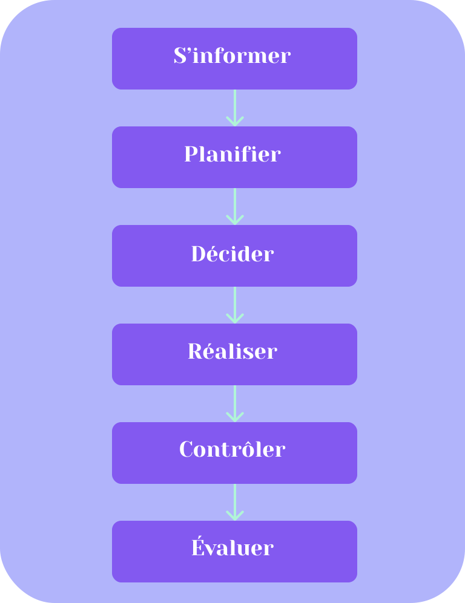

# TIP 2021

## Table des matières

- [TIP 2021](#tip-2021)
  - [Table des matières](#table-des-matières)
  - [1. Introduction](#1-introduction)
    - [1.1 Structure des fichiers](#11-structure-des-fichiers)
  - [2. Rappel de l'énoncé](#2-rappel-de-lénoncé)
  - [3. Méthodologie](#3-méthodologie)
  - [4. Planification](#4-planification)

## 1. Introduction

### 1.1 Structure des fichiers

```
.
├── db
│   ├── configDb
│   │   └── paramconn.php
│   ├── controllers
│   │   └── db_controller.php
│   └── classes
│       ├── database.php
│       └── utilisateur.php
└── public
    └── index.php

```

## 2. Rappel de l'énoncé

## 3. Méthodologie



## 4. Planification

```php
    public function __construct($unUsername, $unPrenom, $unNom, $unAge, $unNumTel, $unEmail, $unMdp)
    {
        $this->setNomUtilisateur($unUsername);
        $this->setPrenom($unPrenom);
        $this->setNom($unNom);
        $this->setAge($unAge);
        $this->setNumTel($unNumTel);
        $this->setEmail($unEmail);
        $this->setMdp($unMdp);
    }

    #endregion

    #region Méthodes

    /**
     * Fonction qui retourne toutes les données associées à un utilisateur
     *
     * @return array
     */
    public static function SelectAllInfoFromUser(string $unNomUtilisateur): array
    {
        $request = ConnexionPdo::getInstance()->prepare("SELECT * FROM utilisateur WHERE nomUtilisateur = :nomUtilisateur");
        $request->bindParam(":nomUtilisateur", $unNomUtilisateur, PDO::PARAM_STR, 45);
        $request->setFetchMode(PDO::FETCH_ASSOC);
        $request->execute();

        $resultFromReq = $request->fetch();
        return $resultFromReq;
        die();
    }
```
